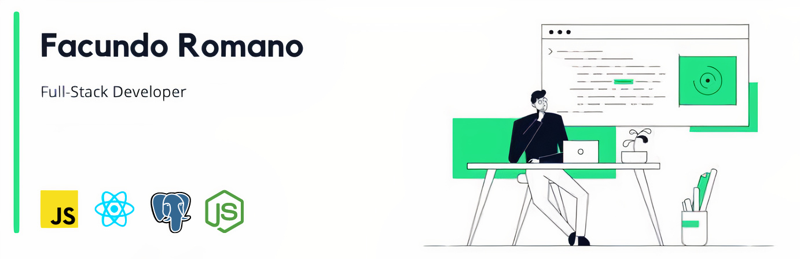

###  Hello, my name is Facundo! 👋

####  I'm a Full Stack Developer from Argentina 💻

Welcome to my github! Here you can see some projects I've worked on!
  

##  🔧 Skills and Technologies

##  👀 Contact me with

* [][linkedin] LinkedIn
*  +54 11 6276-1299
*  facuromano121299@gmail.com
  

##  📈 Github Stats

[linkedin]: https://www.linkedin.com/in/facu-romano-js/
